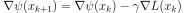
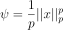
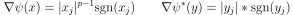
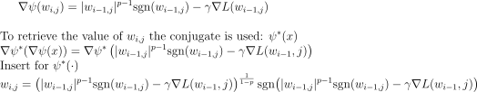
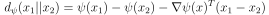

# StochasticMirrorDescent
Implementation of Stochastic Mirror Descent with q norm as potential as optimization method in PyTorch. The goal was to reproduce the results of [1]. The implementation of [2] is used for ResNet-18 to use on CIFAR, as Pytorch's module is designed for ImageNet with a more aggressive downsampling.

## The method: 
Mirror descent is a gradient based optimization algortihm. It works by using a strictly convex differentiable function as a mirror map. The update rule is as follows



Where the function psi transforms the input before the gradient step is taken. Let the mirror map be:



It can then be shown that:



To apply the method to a neural network with weights denoted as w, we can insert and find the update rule




## To run 

```
python3 main [-q] [-lr] [-init] [-create_init] [-ngpu]
```
<ul>
<li>Argument - Description - Default value
  
<li>q - The q for the q norm - 1

<li>lr - learning rate - 0.02

<li>init - Which initialization weights to be used - 1
  
<li>create_init - If initializations should be created, 1 for true, 0 for false - 1
  
<li>ngpu - number of gpus - 1

</ul>

This will create four directories with an initialization of the weights of ResNet18 each, and train one network with the given parameters. 

## Bregman Divergences
BD.py calculates the bregman divergences with the given potential psi defined earlier


<ol>
<li>Navid Azizan and Babak Hassibi.Stochastic Gradient/Mirror Descent: Min-imax Optimality and Implicit Regularization. 2019. arXiv:1806.00952 [cs.LG].
  
<li> Yerlan Idelbayev.Proper ResNet Implementation for CIFAR10/CIFAR100in PyTorch.https://github.com/akamaster/pytorch_resnet_cifar10.Accessed: 20xx-xx-xx
